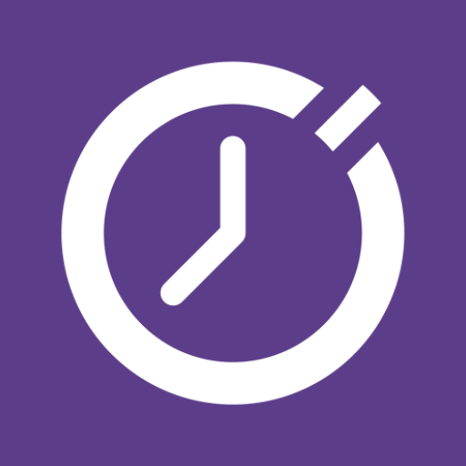

# ⏱️ Krono

**Um cronômetro minimalista que flutua sobre qualquer aplicativo.**

[📥 Baixar APK](#-instalação) • [✨ Funcionalidades](#-funcionalidades) • [🖼️ Screenshots](#️-screenshots) • [🤝 Apoiar](#-apoiar-o-projeto)

---

## 📖 Sobre o Projeto

O **Cronômetro Flutuante** é um aplicativo Android independente, gratuito e sem anúncios. Ele exibe um widget flutuante sobre qualquer tela do dispositivo — ideal para medir tempo durante reuniões, treinos, estudos ou qualquer atividade que exija monitoramento de tempo contínuo sem interromper o que você está fazendo.

---

## ✨ Funcionalidades

### ⚙️ Widget Flutuante
- Exibe o cronômetro **sobre qualquer aplicativo** usando `WindowManager`
- **Arraste livre** pela tela com física de borda — gruda nas bordas ao se aproximar e desgruda ao arrastar para dentro
- **Posição persistida** — lembra onde você deixou o widget ao fechar e reabrir
- **Sem interferência** no app em uso — o widget não captura foco nem bloqueia toques

### 🎨 Personalização Completa
- 🎨 **Cor de fundo e de texto** independentes com seletor HSB (Matiz, Saturação, Brilho)
- 🔍 **Opacidade** independente para fundo e texto (0% a 100%)
- 📏 **Escala** do widget de 0.5× a 1.5×
- 🔘 **Arredondamento** das bordas de 0px a 40px
- 💾 Todas as configurações são salvas **automaticamente**

### ⏱️ Controle do Cronômetro
- **Modo Botões** — Play/Pause, Reset, Configurações e Fechar visíveis no widget
- **Modo Gestos** — Controle sem botões:
    - 1 toque → Play / Pause
    - 2 toques → Reset
    - Toque longo → Abrir configurações
- **Notificação Persistente** com botões de Play/Pause, Reset e Fechar — funciona mesmo com o widget oculto

### ⚙️ Configurações Avançadas
- ⏰ **Exibir ou ocultar** horas e segundos independentemente (`HH:MM:SS`, `MM:SS` ou `HH:MM`)
- 🔒 **Limite de tempo** configurável no formato `HHHH:MM:SS` — o cronômetro para automaticamente ao atingir o limite
- 📱 **Manter tela ligada** enquanto o cronômetro estiver rodando
- 🚀 **Abrir diretamente** o widget ao iniciar o app
- 🔔 **Bipe e vibração** ao dar Play/Pause
- 🔄 **Sobrevive a reboots** — o cronômetro é restaurado após reiniciar o dispositivo

### 🔒 Confiável e Eficiente
- Roda como **Foreground Service** — o Android não encerra o cronômetro em background
- Tempo baseado em **Unix Timestamp** — preciso mesmo após fechamentos forçados
- Sem coleta de dados, sem rastreamento, sem internet obrigatória

---

## 📥 Instalação

> ⚠️ **Requisito:** Android 8.0 (Oreo) ou superior.

### Passo a passo

**1.** Acesse a página da última versão:

👉 **[github.com/gustavo-praxedes/krono/releases/latest](https://github.com/gustavo-praxedes/krono/releases/latest)**

**2.** Na seção **Assets**, toque em **`krono-vX.X.X.apk`** para baixar.

**3.** No seu Android, acesse **Configurações → Segurança** e habilite **"Instalar de fontes desconhecidas"** (ou "Instalar apps desconhecidos") para o seu navegador ou gerenciador de arquivos.

**4.** Abra o arquivo `.apk` baixado e toque em **Instalar**.

**5.** Abra o app e conceda as permissões solicitadas:
- **Exibir sobre outros apps** — necessária para o widget flutuante
- **Notificações** — necessária para a notificação persistente (Android 13+)

---

## 🖼️ Screenshots

| Tela de Configurações | Widget Flutuante | Seletor de Cores |
|:---:|:---:|:---:|
| *(em breve)* | *(em breve)* | *(em breve)* |

---

## 🛠️ Tecnologias Utilizadas

| Tecnologia | Uso |
|---|---|
| **Kotlin** | Linguagem principal |
| **Jetpack Compose** | Interface declarativa |
| **Foreground Service** | Cronômetro em background |
| **WindowManager** | Widget flutuante sobre outros apps |
| **DataStore Preferences** | Persistência de configurações |
| **SharedPreferences** | Persistência do estado do timer |
| **Coroutines + Flow** | Programação assíncrona reativa |

---

## 📋 O que há de novo

<!-- O bloco abaixo é atualizado automaticamente pelo CHANGELOG.md a cada release -->

Veja o histórico completo de mudanças em **[CHANGELOG.md](CHANGELOG.md)**.

As novidades da versão mais recente estão listadas abaixo:

---

[//]: # (CHANGELOG_LATEST_START)

## [1.2.3](https://github.com/gustavo-praxedes/krono/compare/v1.2.2...v1.2.3) (2026-04-08)

[//]: # (CHANGELOG_LATEST_END)

---

## 🤝 Apoiar o Projeto

Este app é **gratuito, sem anúncios e de código aberto**. Se ele tem sido útil para você, considere apoiar o desenvolvimento:

| Forma de apoio |                              Link                               |
|:---:|:---------------------------------------------------------------:|
| 💛 **Ko-fi** | [ko-fi.com/gustavo-praxedes](https://ko-fi.com/gustavopraxedes) |
| 🟩 **Pix** |                         `SUA_CHAVE_PIX`                         |

Qualquer contribuição ajuda a manter o projeto **gratuito e em constante evolução**. Obrigado! 🙏

---

## 🐛 Reportar Problemas

Encontrou um bug ou tem uma sugestão?

👉 [Abrir uma Issue](https://github.com/gustavo-praxedes/krono/issues/new)

---

## 📄 Licença

Distribuído sob a licença **MIT**. Veja [LICENSE](LICENSE) para mais informações.

---

Feito com ❤️ por [Gustavo Praxedes](https://github.com/gustavo-praxedes)

⭐ Se este projeto foi útil, deixe uma estrela no repositório!

